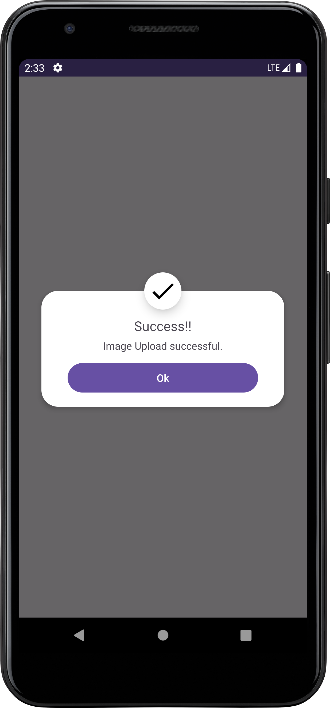
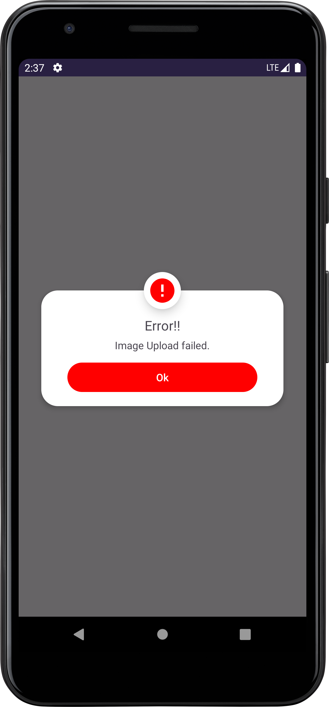
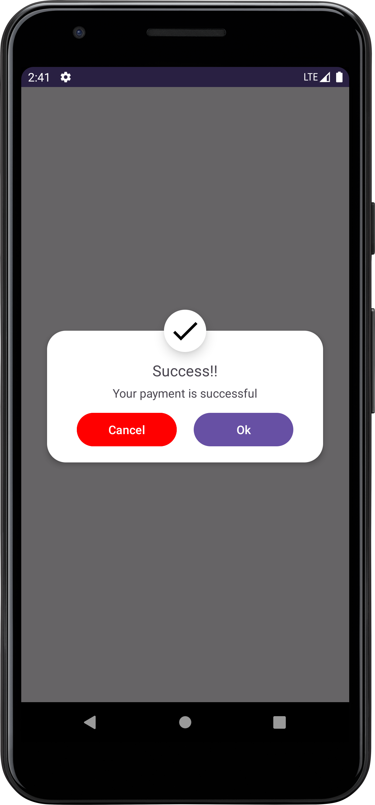
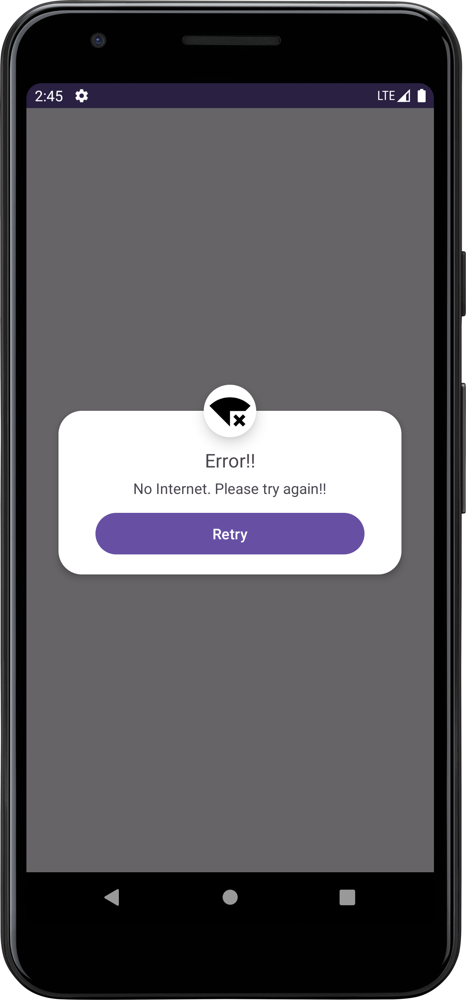

# Sweet-Dialog
Simple Alert Dialog library

> Step 1. Add the JitPack repository to your build file

``` gradle
allprojects {
		repositories {
			...
			maven { url 'https://jitpack.io' }
		}
	}
```

> Step 2. Add the dependency

``` gradle
dependencies {

	        implementation 'com.github.sabiruzzaman:Sweet-Dialog:1.0.0'

	}
```
# Usage

``` gradle

                new SweetDialog.Builder(MainActivity.this)
                        .setImage(getDrawable(R.drawable.your_icon))
                        .setTitle("Your title")
                        .setBody("Your body")
                        .setPositiveBtnTxt("Your positive button text")
                        .setNegativeBtnTxt("Your negative button text")
                        .setPositiveBtnColor(R.color.your_positive_button_color)
                        .setNegativeBtnColor(R.color.your_negative_button_color)
                        .setPositiveListener(() -> {
                           // TODO add your positive logic here
                        })
                        .setNegativeListener(() -> {
                            // TODO add your negative logic here
                        })
                        .setCancel(true)
                        .build();

```

> Single Positive Button

``` gradle

                new SweetDialog.Builder(MainActivity.this)
                        .setImage(getDrawable(R.drawable.your_icon))
                        .setTitle("Your title")
                        .setBody("Your body")
                        .setPositiveBtnTxt("Your positive button text")
                        .setPositiveBtnColor(R.color.your_positive_button_color)
                        .setPositiveListener(() -> {
                           // TODO add your positive logic here
                        })
                        .setCancel(true)
                        .build();

```

# Screenshot
   
